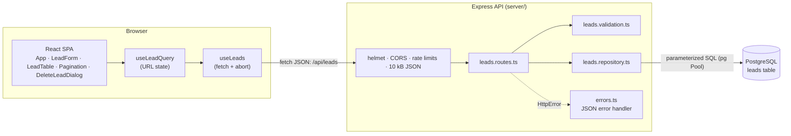

# Lead Tracker

A full-stack app for tracking sales leads: add a lead, find it again by name, email or phone,
filter by status, and move it through the pipeline (`new` → `contacted` → `qualified` →
`converted` / `lost`).

**Live app:** _add the frontend URL here after deploying_ · **API health:** _add `<api-url>/api/health`_

| Part     | Stack                                                          | Folder    |
| -------- | -------------------------------------------------------------- | --------- |
| Frontend | React 19 + TypeScript, Vite, plain CSS, `lucide-react`, `sonner` | `client/` |
| Backend  | Node.js + TypeScript, Express 5, `helmet`, `express-rate-limit` | `server/` |
| Database | PostgreSQL (hosted on Supabase) via `pg`, parameterized SQL, no ORM | `server/db/` |
| Tests    | Vitest, Supertest, React Testing Library + jsdom               | both      |

## Features

- **Create leads** with name, email and phone. The API validates every field and returns
  per-field messages, which the form shows under the matching input (and focuses the first
  invalid one). Emails are unique regardless of case.
- **List leads** newest first, with numbered pages and a page-size selector.
- **Search** name, email and phone at once. Every word must match somewhere, in any order
  (`rao asha` finds "Asha Rao"), and a phone number matches however it was typed
  (`9876543210` finds `+91 98765 43210`).
- **Filter by status**, alone or combined with a search.
- **Update the status** inline from the table; `updated_at` is kept accurate by a database trigger.
- **Delete leads** after confirming in a dialog; the page refills and the total updates.
- **Shareable views:** search, filter, page and page size live in the URL.
- **Loading states everywhere:** a skeleton table on first load, a progress bar over dimmed
  rows while the next page loads, a spinner in the search box, and busy states for adding,
  status changes and deleting.
- **Responsive and accessible:** the table turns into cards on phones, long names and emails
  are truncated (full text on hover), light/dark theme follows the system, and every control
  is labelled and keyboard reachable.

## Architecture



A request flows through three small layers on the server:

1. **Routes** (`leads.routes.ts`) are thin: they parse the input, call the repository and map
   domain errors to HTTP status codes (e.g. a duplicate email becomes `409`).
2. **Validation** (`leads.validation.ts`) turns untrusted input into typed values or throws an
   `HttpError(400)` with per-field details. It is the single source of truth for the rules;
   the client only mirrors the length limits as `maxLength`.
3. **Repository** (`leads.repository.ts`) owns all SQL. Queries are parameterized, and rows are
   mapped from `snake_case` columns to the camelCase `Lead` type.

Express 5 forwards errors thrown in async handlers, so the central `errorHandler` turns every
`HttpError` into `{ error, details? }` and every unexpected error into a generic `500`.

On the client, `useLeadQuery` keeps the search, status, page and page size in sync with the URL,
and `useLeads` fetches the matching page, aborting the previous request when the query changes
so a slow response can never overwrite a newer one.

```text
client/src/
  App.tsx              page layout: form, filters, table, pagination, toasts
  api.ts               typed fetch wrapper and ApiError
  leadQuery.ts         URL <-> query parsing with safe fallbacks
  hooks/               useLeads, useLeadQuery, useDebouncedValue
  components/          LeadForm, LeadTable, Pagination, DeleteLeadDialog, SiteHeader
server/
  db/schema.sql        idempotent schema: table, indexes, trigger, row level security
  scripts/             db:schema and db:seed
  src/app.ts           middleware stack
  src/leads/           routes -> validation -> repository
  tests/               API, validation, security and PostgreSQL tests
```

## Getting started

### Prerequisites

- Node.js 22.12+ or 24+
- A PostgreSQL database (local, or a free Supabase project)

### 1. Backend

```bash
cd server
npm install
cp .env.example .env   # then set STYLE_WORK_DB_URL (and CORS_ORIGIN if needed)
npm run db:schema      # create or upgrade the leads table (safe to re-run)
npm run db:seed        # optional: insert 100 random demo leads
npm run dev            # http://localhost:3000
```

<http://localhost:3000/api/health> should return `{"status":"ok"}`. The server connects to
PostgreSQL on startup and exits with an error if `STYLE_WORK_DB_URL` is missing or the database
is unreachable.

### 2. Frontend

```bash
cd client
npm install
npm run dev            # http://localhost:5173
```

In development the frontend calls the API at `http://localhost:3000`. To use another URL, copy
`client/.env.example` to `client/.env.local` and set `VITE_STYLE_WORK_API_URL`.

## Scripts

| Folder    | Script               | What it does                                                   |
| --------- | -------------------- | -------------------------------------------------------------- |
| `server/` | `npm run dev`        | Start the API with auto-reload (tsx watch)                     |
| `server/` | `npm run build`      | Compile TypeScript to `dist/`                                  |
| `server/` | `npm start`          | Run the compiled server (`dist/index.js`)                      |
| `server/` | `npm run typecheck`  | Type-check all TypeScript without emitting                     |
| `server/` | `npm test`           | Run the test suite once (`npm run test:watch` to watch)        |
| `server/` | `npm run db:schema`  | Apply `db/schema.sql` to `STYLE_WORK_DB_URL`                   |
| `server/` | `npm run db:seed`    | Insert 100 random leads (`npm run db:seed -- 250` for another count); refuses to run with `NODE_ENV=production` |
| `client/` | `npm run dev`        | Start Vite with hot reload                                     |
| `client/` | `npm run build`      | Type-check and build the static site into `dist/`              |
| `client/` | `npm run lint`       | Run ESLint                                                     |
| `client/` | `npm test`           | Run the test suite once (`npm run test:watch` to watch)        |

## API

| Method  | Path                                                | Body                     | Success                              |
| ------- | --------------------------------------------------- | ------------------------ | ------------------------------------ |
| `GET`   | `/api/health`                                       |                          | `200 {"status":"ok"}`                |
| `GET`   | `/api/leads?search=term&status=new&page=1&limit=20` |                          | `200` a page of leads, newest first  |
| `POST`  | `/api/leads`                                        | `{ name, email, phone }` | `201` created lead                   |
| `PATCH` | `/api/leads/:id`                                    | `{ status }`             | `200` updated lead                   |
| `DELETE` | `/api/leads/:id`                                    |                          | `204` no content                     |

All `GET /api/leads` parameters are optional and can be combined:

| Parameter | Default | Description                                                         |
| --------- | ------- | ------------------------------------------------------------------- |
| `search`  |         | Words matched against name, email and phone (see below), max 100 chars |
| `status`  |         | Only leads with this status                                         |
| `page`    | `1`     | 1-based page number                                                 |
| `limit`   | `20`    | Leads per page, 1–100                                               |

It returns the page plus the total number of matching leads, so clients can render page links:
`{ "leads": [...], "total": 57, "page": 1, "limit": 20 }`. A page past the end returns an empty
`leads` array with the real `total`.

A lead looks like:

```json
{
  "id": 1,
  "name": "Asha Rao",
  "email": "asha@example.com",
  "phone": "+91 98765 43210",
  "status": "new",
  "createdAt": "2026-09-23T10:15:00.000Z",
  "updatedAt": "2026-09-23T10:15:00.000Z"
}
```

New leads always start as `new` (a `status` sent on create is ignored). Errors return
`{ "error": "message" }`, plus a `details` object with per-field messages on validation errors:
`400` invalid input, `404` lead not found (also when deleting a lead that is already gone),
`409` email already exists, `413` body over 10 kB, `429` rate limit exceeded.

### Validation rules

| Field   | Rule                                                                                     |
| ------- | ---------------------------------------------------------------------------------------- |
| `name`  | Required, at most 100 characters                                                         |
| `email` | Required, at most 254 characters, `local@domain.tld` with no empty domain labels         |
| `phone` | Required, at most 30 characters: digits, spaces, `-`, `(`, `)`, `.`, an optional leading `+`, and 7–15 digits (the E.164 maximum) |

Before these checks, every text value is Unicode-normalized (NFC), runs of whitespace and line
breaks collapse to a single space, and surrounding whitespace and zero-width characters are
trimmed, so a value that only *looks* empty is rejected as empty. Control characters (including
NUL, which PostgreSQL refuses to store) are rejected with a `400` instead of causing a `500`.

### Search

The search term is split into words, and **every word** must appear (case-insensitively) in the
name, email or phone, so word order doesn't matter and `ravi shop.in` can match a name and an
email at once. If the whole term looks like a phone number (only digits, spaces and
`+ - ( ) .`), it also matches on digits alone, ignoring how the stored number is formatted:
`9876543210`, `+91-98765-43210` and `98765 43210` all find `+91 98765 43210`. The digits-only
match is limited to phone-like terms so that a search such as `asha9` doesn't match every phone
containing a 9. `%` and `_` in a search are matched literally.

## Frontend behaviour

- The search term, status filter, page and page size live in the URL
  (`?search=asha&status=new&page=2&limit=50`), so a reload or a shared link shows the same view.
  The URL is updated with `history.replaceState`, so paging doesn't fill the back button's
  history. Invalid values in a hand-edited link fall back to the defaults.
- Search is debounced (300 ms). Changing the search, filter or page size goes back to page 1;
  a link to a page past the end moves to the last page that exists.
- Adding a lead jumps to page 1, where it appears as the newest lead.
- Loading states:
  - **First load (or after an error or an empty result):** a skeleton table in the same layout as
    the real one, cards included on phones, announced to screen readers as "Loading leads…".
  - **Changing page, filter or search:** the current rows stay in place, dimmed and marked
    `aria-busy`, under a thin progress bar. Both appear only after 150 ms, so fast responses
    don't flash.
  - **Search:** the search icon becomes a spinner from the first keystroke until the results for
    that term arrive.
  - **Adding:** the button shows "Adding…" and the fields become read-only (not disabled, so the
    first invalid field can still take focus afterwards).
  - **Status change:** the select is disabled and its arrow becomes a spinner.
  - **Deleting:** the dialog shows "Deleting…" and both its buttons are disabled.
  - Animations are turned off for users who prefer reduced motion.
- Status changes are not optimistic: the select is disabled while saving and shows the saved
  value once the API confirms, with a toast either way. When a status filter is active and the
  lead no longer matches it, the page is refetched so it refills from the next page.
- Validation errors appear under their fields and focus moves to the first invalid one, so
  screen readers announce the field together with its error.
- Deleting asks for confirmation in a native modal `<dialog>`, which traps focus, starts on
  **Cancel**, closes on Escape and returns focus to the row's delete button. Both buttons are
  disabled while the request runs; on failure the dialog stays open with an error toast. After
  a delete the page is refetched, so it refills from the next page (or moves back a page if it
  was the last lead there). A lead someone else already deleted is treated as deleted.
- On screens narrower than 640 px each lead is shown as a card. Empty, "no matches" and error
  states (with a retry button) are all handled.
- The page header links to the author's GitHub profile and portfolio.

## Security

- **SQL injection:** every query is parameterized (`$1`, `$2`, …); user input is never
  concatenated into SQL. `LIKE` wildcards in search terms are escaped.
- **Input validation:** all request bodies, ids and query strings are validated, normalized and
  length-limited on the server; control characters are rejected; JSON bodies are capped at 10 kB.
- **Rate limiting (per client IP):** 300 requests and 50 writes (`POST`/`PATCH`/`DELETE`) per 15 minutes,
  applied globally. The health check is exempt so platform probes are never throttled.
  `X-Forwarded-For` is only trusted when `TRUST_PROXY` is set, so clients can't spoof their IP
  to reset their quota.
- **HTTP hardening:** security headers via `helmet` (HSTS, `nosniff`, CSP, frame protection);
  CORS limited to the configured origins and the `GET`/`POST`/`PATCH`/`DELETE` methods.
- **Error handling:** unexpected errors are logged server-side and return a generic `500`, never
  stack traces or database details.
- **Database:** secrets live only in environment variables; row level security blocks
  Supabase's public REST API from reading the table; connections time out after 5 s.
- **XSS:** React escapes all rendered values; lead data is never injected as HTML.

## Database

The schema lives in [`server/db/schema.sql`](server/db/schema.sql): a single `leads` table with
an identity primary key (`INTEGER`, so `pg` returns a number rather than a string), non-blank
`name`/`email`/`phone`, a `status` limited by a CHECK constraint (default `new`),
`created_at`/`updated_at` timestamps, and a case-insensitive unique index on `lower(email)`.
A `(status, created_at DESC)` index serves the status filter together with the newest-first
sort. A `BEFORE UPDATE` trigger sets `updated_at` whenever a row actually changes, so it stays
accurate even for updates made outside the API (e.g. in the Supabase dashboard).

Apply it with `npm run db:schema`, or paste it into the Supabase SQL Editor. It is idempotent,
and re-running it upgrades an older table in place (`updated_at` is added and backfilled from
`created_at`).

## Tests

```bash
cd server && npm test
cd client && npm test
```

### Backend (`server/`)

| File                             | Covers                                                                    | Needs a database |
| -------------------------------- | ------------------------------------------------------------------------- | ---------------- |
| `tests/app.test.ts`              | Health check, JSON 404, malformed JSON                                    | no               |
| `tests/leads.routes.test.ts`     | Status codes, error mapping and query parsing for every endpoint (repository mocked) | no    |
| `tests/leads.validation.test.ts` | Field rules, whitespace/Unicode normalization, control characters, id, search, status, page and limit | no |
| `tests/security.test.ts`         | Security headers, CORS, body size limit, per-IP rate limits (deletes count as writes), `X-Forwarded-For` spoofing | no |
| `tests/seed-data.test.ts`        | Generated demo leads are unique, valid and cover every status             | no               |
| `tests/leads.repository.test.ts` | The real SQL: create, duplicates, word and phone-digit search, wildcards, status filter, pagination and totals, ordering, the `updated_at` trigger, delete | yes |

The repository tests run only when `TEST_DATABASE_URL` is set, and are skipped otherwise. They
create a temporary schema, apply `db/schema.sql` to it and drop it afterwards, so
`TEST_DATABASE_URL` can safely point at the same database as `STYLE_WORK_DB_URL`. Tests never
use `STYLE_WORK_DB_URL` itself.

### Frontend (`client/`)

React Testing Library in a jsdom environment. The API module and toasts are mocked, so no
server is needed.

| File                                 | Covers                                                               |
| ------------------------------------ | -------------------------------------------------------------------- |
| `src/api.test.ts`                    | Request URLs, methods, JSON bodies and error handling                |
| `src/leadQuery.test.ts`              | Reading and writing the URL query, fallbacks for invalid values      |
| `src/components/LeadForm.test.tsx`   | Create flow, per-field server errors and focus, duplicate email, network failures, locked fields while saving |
| `src/components/LeadTable.test.tsx`  | Rows, links, full-text titles and timestamps, status changes, disabled select while saving, delete buttons, busy state and the loading skeleton |
| `src/components/Pagination.test.tsx` | Page links with gaps, disabled previous/next, page size changes      |
| `src/components/SiteHeader.test.tsx` | Header title; author links open in a new tab with `rel="noopener noreferrer"` |
| `src/App.test.tsx`                   | Skeleton, progress bar and busy search, debounced search, status filter, pagination and URL state, empty/error states, status updates, delete confirmation and its failure cases, the "Add a lead" accordion |

## Deployment

The app deploys as three pieces: the database (Supabase), the API (a Node web service, e.g.
Render) and the frontend (any static host, e.g. Render Static Sites, Vercel or Netlify).

1. **Database (Supabase).** Create a project, then run `server/db/schema.sql` in the SQL Editor
   (or `npm run db:schema` locally against it). Copy the **Session pooler** connection string:
   the direct connection is IPv6-only, which many hosts can't reach. Append
   `?sslmode=no-verify` (see [Trade-offs](#trade-offs)).
2. **API (Render Web Service).**
   - Root directory: `server`
   - Build command: `npm ci --include=dev && npm run build` (TypeScript is a dev dependency)
   - Start command: `npm start`
   - Health check path: `/api/health`
   - Environment: `STYLE_WORK_DB_URL` (the pooler URL), `CORS_ORIGIN` (the frontend URL, no
     trailing slash), `TRUST_PROXY=1`, `NODE_ENV=production`
3. **Frontend (static site).**
   - Root directory: `client`
   - Build command: `npm ci && npm run build`, publish directory: `dist`
   - Environment: `VITE_STYLE_WORK_API_URL` = the API's public URL. It is baked into the bundle
     at build time, so rebuild after changing it.
4. **Smoke test:** open `<api-url>/api/health`, then add, search, update and delete a lead in the live
   app. If the browser reports a CORS error, check that `CORS_ORIGIN` matches the frontend
   origin exactly.

Alternatively, serve the frontend and API from one origin behind a reverse proxy that forwards
`/api` to the server; production builds without `VITE_STYLE_WORK_API_URL` call `/api` on their
own origin.

## Environment variables

### `server/.env`

| Variable            | Required | Default                 | Description                                                   |
| ------------------- | -------- | ----------------------- | ------------------------------------------------------------- |
| `STYLE_WORK_DB_URL` | yes      |                         | PostgreSQL connection string (`DATABASE_URL` is used as a fallback) |
| `PORT`              | no       | `3000`                  | Port the API listens on                                       |
| `CORS_ORIGIN`       | no       | `http://localhost:5173` | Comma-separated list of allowed origins                       |
| `TRUST_PROXY`       | no       | unset                   | Number of reverse proxies in front of the API (`1` on Render) |
| `TEST_DATABASE_URL` | no       |                         | Enables the PostgreSQL tests (see [Tests](#tests))            |

### `client/.env.local`

| Variable                  | Required | Default                                                   | Description                                           |
| ------------------------- | -------- | --------------------------------------------------------- | ----------------------------------------------------- |
| `VITE_STYLE_WORK_API_URL` | no       | `http://localhost:3000` in dev, same origin in production | API base URL (public: it's built into the JS bundle)  |

## Trade-offs

- **Raw SQL instead of an ORM.** One table and five queries don't justify an ORM; plain `pg`
  keeps every query visible and reviewable. The cost is hand-written row mapping and no
  generated migrations (the schema file is written to be idempotent instead).
- **Validation only on the server.** One source of truth, no rules drifting between two copies.
  The cost is a round trip before the form can show "Name is required".
- **Offset pagination.** `LIMIT`/`OFFSET` allows numbered page links and jumping to any page.
  Deep pages get slower and a lead added between two page loads shifts the rest by one; keyset
  (cursor) pagination avoids both but can't jump to page N.
- **`ILIKE '%…%'` search.** Simple and correct, but it can't use a B-tree index, so every search
  scans the table. Fine for thousands of leads; see Future improvements for scaling it.
- **Hard delete.** Deleting removes the row for good, guarded only by the confirmation dialog.
  A `deleted_at` column (soft delete) would allow undo and an audit trail, at the cost of
  filtering deleted rows out of every query and making the unique email index ignore them.
- **Phones stored as typed.** Numbers keep the user's formatting and search compares digits.
  Full normalization to E.164 would need a country for numbers without a `+` prefix.
- **No authentication.** The assignment has no users, so anyone who can reach the app can read
  and change the leads. The deployed instance should only hold demo data.
- **TLS to Supabase is encrypted but not verified.** `pg` treats `sslmode=require` as
  `verify-full`, which rejects Supabase's own CA, so the connection string uses
  `sslmode=no-verify`. Pinning Supabase's CA certificate would close the man-in-the-middle gap.
- **In-memory rate limits.** Each server instance counts separately and counters reset on
  restart. Enough for a single instance.

## Future improvements

- Authentication and per-user or per-team leads.
- A `pg_trgm` GIN index (or full-text search) so search stays fast on large tables.
- Verify the database TLS certificate using Supabase's CA.
- Edit lead details, notes and a status history (activity timeline).
- Column sorting, CSV import/export, and counts per status.
- A shared rate-limit store (e.g. Redis) for multiple API instances.
- CI (GitHub Actions) running lint, typecheck and both test suites on every push, plus ESLint
  for the server.
- End-to-end tests (Playwright) against a real API and database, and an OpenAPI description of
  the API.

## AI usage

This project was built with an AI coding agent. See [AGENT.md](AGENT.md) for the tools, the
prompts, which parts were AI-generated and the key engineering decisions.
